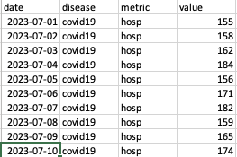

# PROF Advanced Topics

The observed time-series data for both COVID-19 and influenza can be rather intricate, even within a single season.
For instance, during the 2023-2024 season, many states (such as CA, FL, GA) experienced two distinct waves of COVID-19.
Similarly, influenza can exhibit a dual wave attributed to different strains, e.g. influenza A and B.
Whereas the PROF mechanistic framework includes only a single strain for each pathogen it does attempt to fit and forecast these complex time-series by employing a flexible time-dependent term for the force of infection.
PROF uses a smoothly varying two- or three-value functional form to describe the time-dependent reproduction number, R(t) = β(t)γ where β(t) is the time-dependent transmission rate and γ is the total recovery rate.
The first advanced topic we discuss is the choice of number of values for R(t), two vs. three.
We illustrate this with the 2023-2024 COVID-19 time-series data for CA.
We note that the example we show is somewhat extreme and not typical.
It shows how a two-value fit to the data fails whereas the three-value fit is quite good.
In general, we recommend starting with a two-value model and trying the three-value model only if the two-value one fails.

## Selecting the number of values for R(t)

Suppose that we are trying to fit the CA COVID-19 time-series for 2023-2024 from July 1st, 2023 to December 31, 2023 (dashed vertical line in the figure below): the data shows a peak in the late summer/fall and the start of winter wave.

We start by selecting the SEIRH model, the two-value option for the force of infection and start and end dates of July 1, 2023 and December 2023, respectively.
These choices are shown in the figure below.

The results of this fit are poor.
In the figure below black circles are reported data and shaded areas are the median, 50\`% and 95% confidence intervals.
We see that the two value model is unable to fit the early peak and winter rise and is settling into a single broad peak.
Clearly this fit would result in a poor forecast.

Given these poor results we will now repeat the fit with a three-value model and the results of this fit are shown below.
We see that the more flexible three-value model improves the fit significantly although even this fit is not perfect: the rise in the second wave in the model is slower than the observed data.

We note that as the season progresses the fit with a two-value force of infection improves and is able to fit the two peaks: using one value for each peak (see below).
This example demonstrates the complexity of the fits and our somewhat limited ability to control the convergence of the optimization procedure.
As discussed below, our 'control knobs' are limited to the minimum and maximum values we explore in the search for optimal parameters.

To conclude, this example demonstrates the need to experiment with the mechanistic models.
We suggest starting with a two-value force of infection and if the results are not-satisfactory to try and repeat the fit with a three value model.
If no improvement is achieved with three values you can try to improve the results by changing the default values for the initial guess of the fitted parameters and their allowed ranges.
This requires more knowledge in R and is discussed below.

## Uploading Your Own Data

To fit and forecast your own data, you will need to provide a CSV data file containing daily hospitalization incidence data, the population size you are modeling, and a location name.
The latter is only needed for display on the plots.
Currently, PROF supports only the modeling of daily hospitalization data for two pathogens: COVID-19 and Influenza.
Your CSV file MUST have the following columns with the following information and format specifications:

(i) column name: date.
    Date information in the format `\%Y-\%m-\%d` , e.g., `2024-10-01`.
    Currently we only support daily data

(ii) column name: disease.
     String with disease name.
     Currently we only support `covid19` and `influenza`.
     This information must be provided for each incidence date.

(iii) column name: metric.
      String with the metric of incidence.
      Currently, PROF only supports `hosp`.

(iv) columns name: value.
     Numeric.
     Non-negative incidence value.

We require the incidence data to be in long format, i.e., if you are providing data for both pathogens, list all the data for the first one followed by the data for the second one.
The figure below presents an example of the expected format.
The COVID-19 data is followed by the influenza data.
Only a small portion of the COVID-19 data is displayed, and none of the influenza data is shown.

Please note that PROF supports the fitting and forecasting of only ONE season at a time.

## Editing the Parameter File

## Inferring Mortality
