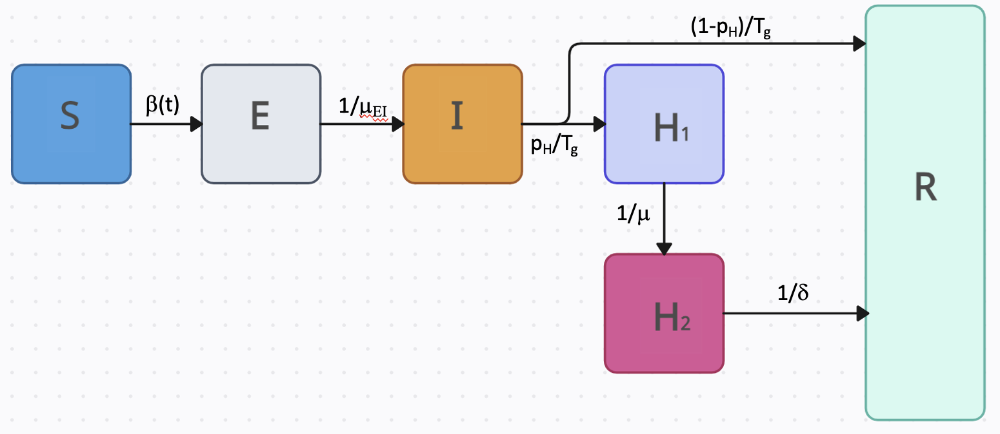

# PROF

Welcome to the documentation site for the PROF package. PROF is an R package (with Fortran code) for fitting and forecasting infectious disease 
incidence. The package ingests publicly-available
confirmed hospital admission data, fits mechanistic models to the data, and provides short-term 
probabilistic forecasts. Currently, the package supports fitting and forecasting the individual
and combined burden of influenza and COVID-19 at the state level. S[I]2HR and SE[I]2HR models
are used to fit the two pathogens and both models use a flexible, time-dependent transmission term. Once the User
selects a state, and either one or both viruses, the PROF fitting procedure iteratively determines the joint posterior distribution of model
parameters.  The joint posterior distribution is then used with the model to generate location-specific
probabilistic forecasts of the near-term number of hospital admissions. If both viruses are chosen, this procedure is done twice and the total hospital burden forecast is estimated by combining the trajectory profiles of each disease in multiple ways, including random, ordered, and semi-ordered.

# Data
PROF provides full support for downloading the most up-to-date daily confirmed hospital admission data for COVID-19 and influenza. 
The data set is provided by the U.S. Department of Health & Human Services, is updated weekly on Friday, and is called: "COVID-19 Reported Patient Impact and Hospital Capacity by State (RAW)".   For more on the data set, see [here](https://healthdata.gov/dataset/COVID-19-Reported-Patient-Impact-and-Hospital-Capa/6xf2-c3ie).

# Compartmental Models

PROF uses compartmental models with a flexible, time-dependent transmission term to fit daily hospitalization data. For both COVID-19 and influenza, the models include a hospitalization compartment which is split into two sub-compartments. This split ensures that the model preserves the correct generation time (Tg) and that the ratio between cumulative recovered and hospitalized individuals is determined by the infection-hospitalization-ratio (pH). For influenza, individuals begin in the susceptible compartment. If exposed, they transition (&beta;(t)) to the infectious compartment where there is a probability of hospitalization or recovery (pH/1-pH) Individuals progress (1/&mu;) from the first hospitalization compartment (H1) to the second (H2), and the number entering this compartment is recorded as daily incidence (and optimized, see below). 

A similar model is used for COVID-19 with the only difference being the addition of the Exposed (but not yet infectious) compartment.

# Time-Dependent Force of Infection

We use a smoothly varying two-value functional form to describe the time-dependent reproduction number: R(t) = &beta;(t)&gamma;, where &beta;(t) is the time-dependent transmission rate is &gamma; is the total recovery rate. 

$$R(t)=\frac{1}{2}\left( R_{0} + R_{1} + (R_{1}-R_{0})tanh\left( \frac{t-t_{0}}{L} \right) \right)$$

The above equation produces a smooth curve where at roughly time t0 the value of R(t) transitions from R0 to R1 
with an approximate transition time of ~2L days.

# Methodology - Fitting, Forecasting, and Combined Burden
PROF fits each pathogen independently and sequentially.   For each pathogen, we determine the joint posterior distribution of model parameters by fitting the daily confirmed hospital admission time series using an adaptive-step-size MCMC procedure.  Only parameters that govern the time variation of R(t) and the probability of hospitalization are optimized and all other parameters are taken from the literature. By default, a fast Fortran code is used for the MCMC procedure (in the future, we hope to be able to offer a second, slower-but-faster-than-R, option that does not require a Fortran compiler). Once the fitting of one pathogen is completed, PROF proceeds to fit the second pathogen.  The posterior distribution of each fit can be used to (1) Create a probabilistic plot of the fit, (2) Create a probabilistic forecast (and plot thereof) for each pathogen.  The final step for PROF is providing an estimate for the forecast of the combined burden.  Currently, the combined burden is estimated in two ways (1) By summing the sorted trajectories of each pathogen (implying a perfect correlation between the errors of the two forecasts), or (2) By randomly summing the trajectories (implying no correlation between the errors of the two forecasts).  In the near future, we plan to offer a third alternative which is based on an error correlation procedure we are working on.

