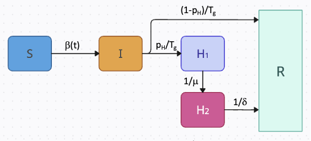

# PROF

Welcome to the documentation site for the PROF package. PROF is an R package (with Fortran code) for fitting and forecasting infectious disease 
incidence. The package ingests publicly-available
confirmed hospital admission data fits mechanistic models to the data, and provides short-term 
probabilistic forecasts. Currently, the package supports fitting and forecasting the individual
and combined burden of influenza and COVID-19 at the state level. An S[I]2HR and SE[I]2HR models
are used to fit the two pathogens and both use a flexible time-dependent transmission term. Once the User
selects a state, and either one or both viruses, the PROF sequential fitting procedure determines the joint posterior distribution for the model
parameters.  The joint posterior distribution is then used with the model to generate location-specific
probabilistic forecasts of the near-term number of hospital admissions. If both viruses are chosen, this procedure is done twice and the total hospital burden forecast is estimated by combining the trajectory profiles of each disease in multiple ways, including random, ordered, and in-between.

# Data

# Compartmental Models

PROF uses compartmental models with a flexible time-dependent transmission term to fit daily hospitalization data. For both COVID-19 and influenza, the models include a hospitalization compartment which is split into two subcompartments. This split ensures that the model preserves the correct generation time (Tg) and that the ratio between cumulative recovered and hospitalized individuals is determined by the infection hospitalization ratio (p~H~). For influenza, individuals begin in the susceptible compartment. If exposed they transition (beta(t)) to the infectious compartment where there is a probability of hospitalization or recovery (p~H~/1-p~H~) Individuals progress (1/mu) from the first hospitalization compartment (H~1~) to the second (H~2~), and the number entering this compartment is recorded (and optimized, see below). 

{ align = left } 

Create sketch for SE[I]~2HR

# Time-Dependent Force of Infection

Will be explained here

# Methodology - Fitting, Forecasting and Combined Burden

Explain the fitting procedure, forecasting and combining forecasts

