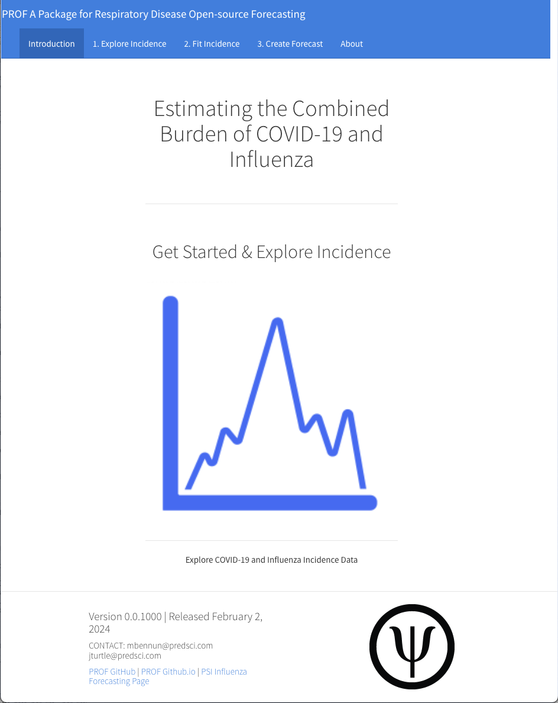
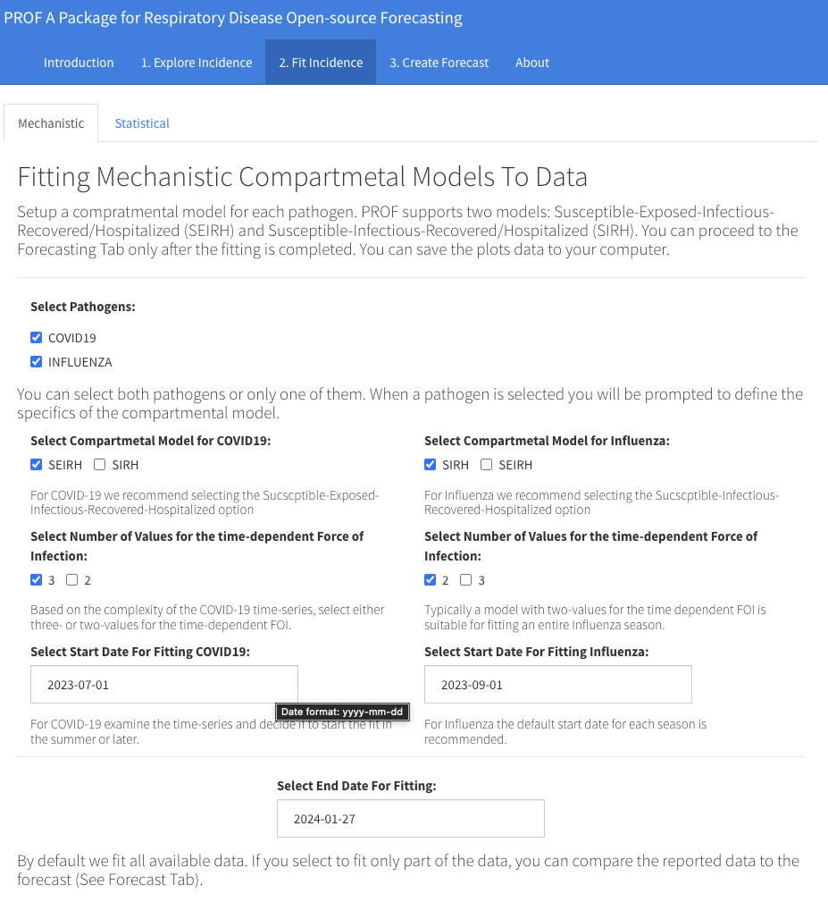
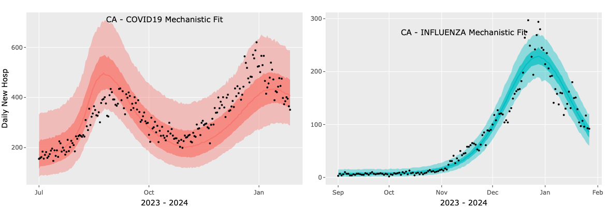
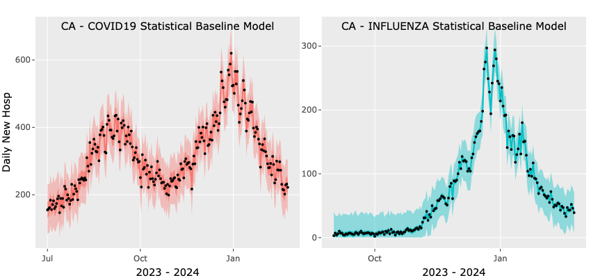
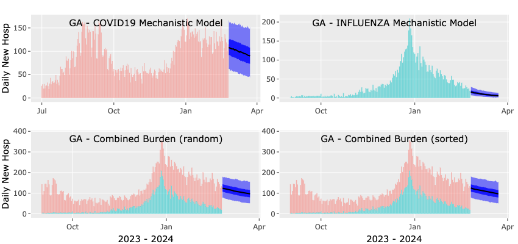
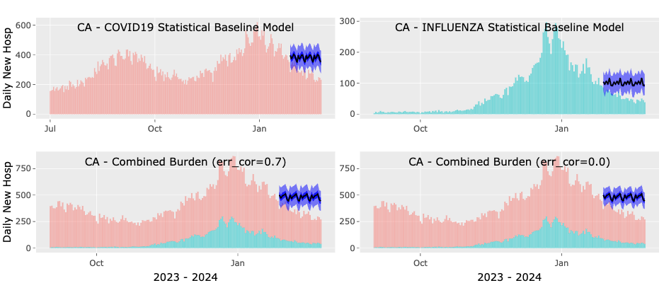
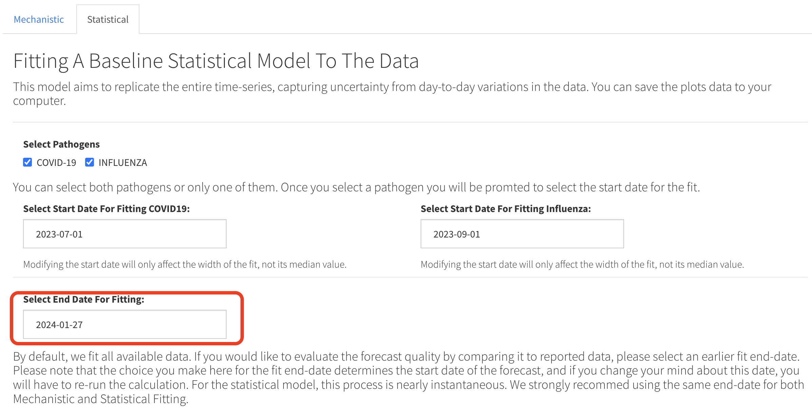
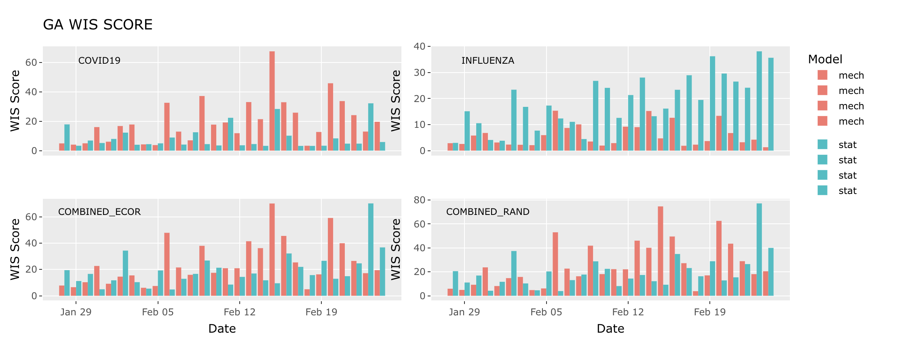

# PROF Tutorial

This tutorial is configured assuming an Rstudio session with the PROF-Shiny-app GUI. It assumes that PROF has been successfully installed and that the PROF-shiny-app has been cloned.

## Opening the App

We will start by opening an Rstudio session and opening the PROF shiny app. To open the app open the ui.R file downloaded when you cloned the shiny-app and click on the green`Run App` icon.

At this stage R may install packages that are required by the shiny-app but once this is completed a shiny window will open with the landing page of the application

You can continue to work in the shiny window or select to open it in a browser. The landing page provides links to all our documentation and repositories (bottom left) and is the gateway to the Incidence page.

## 1. Explore Incidence

To proceed to the `Explore Incidence` Tab you can either click on the cartoon data image or click on the tab itself. Here, the two dropdown menus allow you to select a location and a season. (We support all seasons covered by the HHS dataset.) Before you make your selection please read the message about the local PROF-Shiny data file. If the message indicates that the datafile is up-to-date there is no need for any action but if it indicates that there may be newer data we recommend that you update the data file using the Download button. Once you have read the message, and acted if recommended, proceed to make you selections for a location and a season and press the `Plot Incidence Data` button. Two plots will appear showing daily new hospital admission for COVID-19 and Influenza (top and bottom plots, respectively). As you hover over each plot, you can inspect specific dates/values. Each plot can be saved as a png file using the camera icon and the data associated with the plots can be saved by clicking the `Save Incidence Data` button. To view another location and/or season make your new selections and press the `Plot Incidence Data` button. The current plots will be greyed-out while the new request is processed. Once you are satisfied with your selections for location and season you can proceed the Tab number 2, `Fit Incidence`.

## 2. Fit Incidence

Fitting will always be done on the currently selected location and season. You can select to fit the data with a mechanistic compartmental model and/or a baseline statistical model. The latter fit is basically instantaneous whereas the mechanistic fit(s) will take 5-10 minutes (depending on the details of the fit).

### Mechanistic Fit

In the case of a Mechanistic fit you must first decide which pathogens you want to fit. Once you click on a pathogen you are prompted to define the model. This includes selecting a compartmental model (SEIRH or SIRH), the number of values for the time-dependent force of infection (FOI) and the start date for the fit. We recommend using the SEIHR/SIRH models for COVID-19/Influenza respectively. The choice of the number of values for the FOI depends on the complexity of the time-series you are fitting. As a rule-of-thumb, we recommend using the 3-value option only if the time series exhibits more than one peak. In all other cases we recommend using the 2-value option. Note that the complexity of the time-series may depend on your selection for the start-date for the fit. By default, this date is set for both pathogens to the start of the season but you can change that. When fitting both pathogens, the start date for the fit does not need to be the same for both pathogens but the end date must be. By default the end date is set to the last date with reported data but you can modify that to an earlier date. If you do that, then at the forecasting step you will be able to compare the forecast to the observations. The Figure below shows an example of the shiny window when all the selections have been made

Once you have made all your selections you can press the `Mechanistic Fit to Incidence` button. A message will appear indicating that the fitting has started and will take 10-15 minutes. You can follow the progress of the fitting in the console window of you Shiny session. When the fitting is complete either one or two plots will appear showing the results of the fit along with the data. We show the median, 50 and 95 confidence intervals. As in the case of the incidence plots here too you can click on the camera icon to save each plot or on the `Save Plots Data` button to download the plots data as a csv file. An example of fit plots you should see if you selected to fit both pathogens is shown below.

Please note that while the mechanistic fit is in progress you can not execute any other command in the Shiny app. When the fitting is complete you can proceed to either the `Statistical` option for fitting or to Tab 3: `Create Forecast`.

### Statistical Fit

The simple baseline statistical model is designed to reproduce all the data points and create an uncertainty based on day-to-day variations in the data. Here we only ask the User to select which pathogen they would like to fit, what is the start date for each fit and what is the end date for the fit(s). Here too we support individual start dates but require the same end date. When you have made your selection press the `Statistical Fit to Incidence Button` and after a few seconds one or two plots will appear (based on the number of pathogens you selected to fit). As always, you can click on the camera icon to save each plot or on the `Save Plots Data` button to download the plots data as a csv file.

## 3. Forecast Incidence

Forecasting will always be done on the currently selected location, season, pathogens and models.

### Mechanistic Forecast

The mechanistic forecast is based on the posterior distribution of the parameters coming out of the fit. This means that only pathogens that you selected for a mechanistic fit can be forecasted. We ask the User to make either one or two selections depending on the scenario. If only one pathogen was fitted, the User only needs to select the number of days for the forecast. By default, this value is set to 28 days, and users can adjust it using the slider. If both pathogens were fitted, we ask the User to specify the value of the error-correlation parameter. This parameter determines the combination of uncertainties present in the individual forecasts. Its default value is one, indicating full correlation between individual errors and resulting in greater uncertainty. Users can modify this default value using the slider. It's important to note that, regardless of the user's selection, PROF will always generate an estimate of the combined burden with an error-correlation value of zero. Once you made you selection(s) press the `Mechanistic Forecast` button. The plots will appear after less than a minute. The top left/right plots show the forecast for COVID-19/Influenza (median, 50 and 95 confidence intervals). The bottom plot shows our estimate for the combined burden calculated either with an error-correlation value of zero (right panel) and using our selection value of 0.7 for the error-correlation parameter. Here too, you can save the plots as a png file and download the data as a csv file. Please remember that the combined burden plots will appear only if you selected to fit and forecast both pathogens.

### Statistical Forecast

Here we use the baseline statistical model for the forecast with all other details being the same as in the Mechanistic Forecast tab. An example of output plots for a statistical forecast is shown below. In this example, we've set the error-correlation parameter to 0.8, as indicated in the legend of the bottom-left panel. The bottom-right panel displays the estimated combined burden, assuming that the errors of the two forecasts are entirely independent. As explained before, the error-correlation parameter governs the width of the combined forecast, with higher values leading to a wider forecast.

### Evaluating Forecasts

By default, PROF is configured to fit the entirety of the data stream, and the forecast time-window begins a day (or a week) after the last data point. Assessing the forecast accuracy is not feasible in this scenario (due to lack of data). However, the User has the option to fit and forecast data from previous seasons or to fit a portion of the current season's data stream. In either of these scenarios, the forecast can be compared to reported observations, and the accuracy of the forecast can be evaluated. PROF uses the [weighted interval score](https://journals.plos.org/ploscompbiol/article?id=10.1371/journal.pcbi.1008618) as implemented in the [scoringutils R package](https://cran.r-project.org/web/packages/scoringutils/index.html) to assess the accuracy of its probabilistic forecasts. Smaller values of WIS indicate forecasts that are more aligned with observations. The evaluation of the WIS uses the data and forecasts cadence and the same quantiles as mandated by the [FluSight Challenge](https://www.cdc.gov/flu/weekly/flusight/index.html).

To evaluate a forecast you must select an `end date` for the fitting that precedes the end date of the data stream. This is done at the `2. Fit Incidence` stage. The end date is set independently for the Mechanistic and Statistical Models. For example, if the data stream ends on 02-24-2024 and you would like to evaluate a 28 day forward forecast you should set the end-date for the fit to be 28 days prior to 02-24-2024, i.e., 01-27-2024. A snapshot of such a selection for the Statistical Model is shown below.

If you plan to also run a mechanistic model we recommend setting the same end date for it so that the accuracy of both models can be evaluated for the same forecast horizon. Once the fitting process is completed, for either one or two models and for either one or two pathogens you can proceed to the `3. Create Forecast` tab. You can create a forecast for each pathogen/model combination you fitted. Your only selection is for the number of days in the forecast horizon with the default being 28 days. Since the forecast step is fast we recommend doing it for all pathogens/models you fitted. The plot below shows the results of a 28 day forward mechanistic forecast.

Based on our selections, there are 28 days of data in the forecast time-window, and we will assess the accuracy of the forecasts for these 28 days. Since we utilized both mechanistic and statistical models to fit both pathogens, we can evaluate the accuracy of both models for each pathogen, as illustrated in the figure below. The top and bottom panels in this figure depict the WIS score of the mechanistic (red) and statistical (blue) models for the COVID-19 and Influenza forecasts, respectively. With lower scores indicating better performance, we observe that the mechanistic forecast outperformed the statistical forecast for nearly all days in the case of COVID-19, while for Influenza, it significantly outperformed the statistical forecast for ALL days.

## About Tab

The `About` tab provides background information about PROF as well as an Acknowledgement and a link to our web documentation. For questions/comments/suggestions/bugs please email us at:

-   *Michal Ben-Nun*: [mbennun\@predsci.com](mailto:mbennun@predsci.com){.email}
-   *James Turtle*: [jturtle\@predsci.com](mailto:jturtle@predsci.com){.email}
-   *Pete Riley*: [pete\@predsci.com](mailtp:pete@predsci.com){.email}
